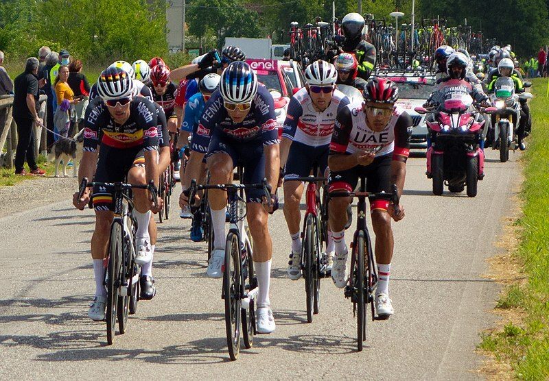
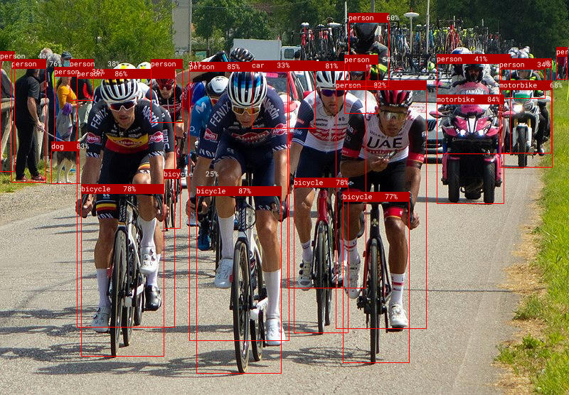
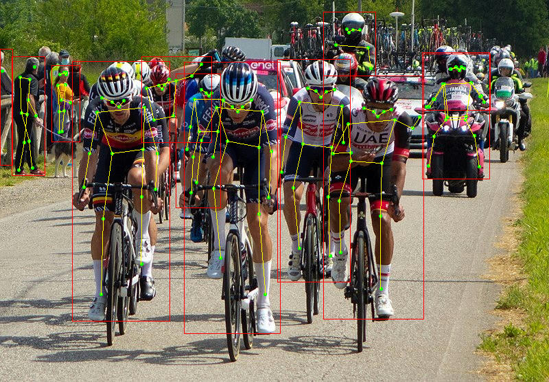

# Object Detection - YOLO

> Candle 0.4.0 git hash
>
> <https://github.com/huggingface/candle/tree/6400e1b0a08d594e1448d522a41bddc98c584313>

<https://github.com/huggingface/candle/tree/6400e1b0a08d594e1448d522a41bddc98c584313/candle-examples/examples/yolo-v8>

```sh
mkdir yolo
cd yolo
cargo init

echo '
[profile.release]
strip = true
lto = true
codegen-units = 1
opt-level = 3'>> \
Cargo.toml

# dependencies
# https://github.com/huggingface/candle/blob/6400e1b0a08d594e1448d522a41bddc98c584313/candle-examples/Cargo.toml
# https://github.com/huggingface/candle/blob/6400e1b0a08d594e1448d522a41bddc98c584313/Cargo.toml

cargo add candle-core --features "metal"
cargo add candle-nn --features "metal"
cargo add candle-transformers --features "metal"

cargo add \
anyhow \
clap \
hf-hub \
tracing \
tracing-chrome \
tracing-subscriber \
--features \
"anyhow/backtrace",\
"clap/derive",\
"hf-hub/tokio"

cargo add \
--no-default-features \
image \
imageproc \
rusttype \
--features \
"image/jpeg",\
"image/png"

# yolo lib

curl -kLo src/lib.rs https://github.com/huggingface/candle/raw/6400e1b0a08d594e1448d522a41bddc98c584313/candle-examples/src/lib.rs
curl -kLo src/coco_classes.rs https://github.com/huggingface/candle/raw/6400e1b0a08d594e1448d522a41bddc98c584313/candle-examples/src/coco_classes.rs
sed -i '' 's/candle::/candle_core::/;s/, Tensor//;2,3d;29,$d' src/lib.rs

# yolo bin

# curl -kLo src/main_rs.tmp https://github.com/huggingface/candle/raw/5e526abc8c0ecad2bd110a34d128e1e6d5333c68/candle-examples/examples/yolo-v8/main.rs
curl -kLo src/main.rs https://github.com/huggingface/candle/raw/6400e1b0a08d594e1448d522a41bddc98c584313/candle-examples/examples/yolo-v8/main.rs
curl -kLo src/model.rs https://github.com/huggingface/candle/raw/6400e1b0a08d594e1448d522a41bddc98c584313/candle-examples/examples/yolo-v8/model.rs
sed -i '' '1,6d;s/candle::/candle_core::/;s/candle_examples::/yolo::/' src/main.rs
sed -i '' 's/candle::/candle_core::/' src/model.rs

curl -kLo src/roboto-mono-stripped.ttf https://github.com/huggingface/candle/raw/6400e1b0a08d594e1448d522a41bddc98c584313/candle-examples/examples/yolo-v8/roboto-mono-stripped.ttf

mkdir -p input
curl -kLo input/bike.jpg https://github.com/huggingface/candle/raw/6400e1b0a08d594e1448d522a41bddc98c584313/candle-examples/examples/yolo-v8/assets/bike.jpg

# Running

# --cpu -> Error: Metal max_pool2d not implemented
cargo run --release -- input/bike.jpg --task detect --cpu
mkdir -p output
mv input/bike.pp.jpg output/bike_detect.jpg

# model loaded
# processing input/bike.jpg
# generated predictions Tensor[dims 84, 5460; f32]
# person: Bbox { xmin: 86.66547, ymin: 72.8295, xmax: 197.10022, ymax: 345.35574, confidence: 0.8568442, data: [] }
# person: Bbox { xmin: 213.18344, ymin: 65.65701, xmax: 326.39407, ymax: 360.4099, confidence: 0.8545273, data: [] }
# person: Bbox { xmin: 378.10486, ymin: 84.69644, xmax: 480.50592, ymax: 346.76508, confidence: 0.8212899, data: [] }
# person: Bbox { xmin: 323.47644, ymin: 64.84567, xmax: 412.29492, ymax: 304.65768, confidence: 0.8112189, data: [] }
# person: Bbox { xmin: 13.499237, ymin: 62.324814, xmax: 53.18788, ymax: 192.77397, confidence: 0.7584885, data: [] }
# person: Bbox { xmin: 563.37994, ymin: 61.865738, xmax: 621.75555, ymax: 162.47084, confidence: 0.63948303, data: [] }
# person: Bbox { xmin: 392.794, ymin: 13.639259, xmax: 438.6928, ymax: 92.06086, confidence: 0.59886265, data: [] }
# person: Bbox { xmin: 387.91693, ymin: 58.18129, xmax: 426.3609, ymax: 120.45427, confidence: 0.53523815, data: [] }
# person: Bbox { xmin: 0.00047302246, ymin: 54.15472, xmax: 17.516453, ymax: 181.89993, confidence: 0.45573875, data: [] }
# person: Bbox { xmin: 491.92337, ymin: 57.26581, xmax: 575.27783, ymax: 163.37302, confidence: 0.407812, data: [] }
# person: Bbox { xmin: 78.409134, ymin: 62.84155, xmax: 106.17236, ymax: 107.69949, confidence: 0.37633756, data: [] }
# person: Bbox { xmin: 61.326904, ymin: 70.49814, xmax: 88.35062, ymax: 154.1929, confidence: 0.36191705, data: [] }
# person: Bbox { xmin: 561.88605, ymin: 62.890194, xmax: 613.89886, ymax: 104.14288, confidence: 0.33934948, data: [] }
# person: Bbox { xmin: 169.87296, ymin: 62.11265, xmax: 206.2056, ymax: 130.0915, confidence: 0.3127334, data: [] }
# person: Bbox { xmin: 625.9919, ymin: 49.599075, xmax: 638.81635, ymax: 84.50856, confidence: 0.3015461, data: [] }
# bicycle: Bbox { xmin: 221.57787, ymin: 196.18909, xmax: 317.9807, ymax: 394.34888, confidence: 0.86943555, data: [] }
# bicycle: Bbox { xmin: 91.25628, ymin: 194.4867, xmax: 185.04108, ymax: 376.82544, confidence: 0.78318036, data: [] }
# bicycle: Bbox { xmin: 331.0038, ymin: 187.66168, xmax: 393.29, ymax: 351.8405, confidence: 0.78255427, data: [] }
# bicycle: Bbox { xmin: 385.79544, ymin: 202.65154, xmax: 461.11673, ymax: 383.61505, confidence: 0.7657109, data: [] }
# bicycle: Bbox { xmin: 184.69553, ymin: 178.7286, xmax: 204.23343, ymax: 241.59848, confidence: 0.25020847, data: [] }
# car: Bbox { xmin: 283.76846, ymin: 63.855225, xmax: 356.52914, ymax: 136.14943, confidence: 0.32579175, data: [] }
# motorbike: Bbox { xmin: 491.945, ymin: 99.77963, xmax: 568.4367, ymax: 215.28323, confidence: 0.8375837, data: [] }
# motorbike: Bbox { xmin: 562.18317, ymin: 84.595116, xmax: 622.7281, ymax: 176.6373, confidence: 0.6846745, data: [] }
# dog: Bbox { xmin: 57.69565, ymin: 148.94354, xmax: 90.11842, ymax: 193.93597, confidence: 0.83116955, data: [] }
# writing "input/bike.pp.jpg"

cargo run --release -- input/bike.jpg --task pose --cpu
mkdir -p output
mv input/bike.pp.jpg output/bike_pose.jpg

# model loaded
# processing input/bike.jpg
# generated predictions Tensor[dims 56, 5460; f32]
# Bbox { xmin: 84.11618, ymin: 66.82599, xmax: 198.90768, ymax: 350.41663, confidence: 0.9063548, data: [KeyPoint { x: 138.97253, y: 116.66734, mask: 0.9856607 }, KeyPoint { x: 144.79742, y: 109.25902, mask: 0.93647575 }, KeyPoint { x: 131.11446, y: 110.82163, mask: 0.95596194 }, KeyPoint { x: 153.87358, y: 102.90352, mask: 0.5949451 }, KeyPoint { x: 119.052795, y: 106.79383, mask: 0.78099924 }, KeyPoint { x: 168.06325, y: 117.17682, mask: 0.9941597 }, KeyPoint { x: 112.914246, y: 122.28459, mask: 0.9967648 }, KeyPoint { x: 183.38486, y: 167.48198, mask: 0.9819226 }, KeyPoint { x: 104.70169, y: 166.89142, mask: 0.9924671 }, KeyPoint { x: 180.89185, y: 206.23482, mask: 0.9786749 }, KeyPoint { x: 97.898094, y: 203.77618, mask: 0.98967606 }, KeyPoint { x: 166.94606, y: 162.51411, mask: 0.9983851 }, KeyPoint { x: 130.76782, y: 167.13025, mask: 0.9988362 }, KeyPoint { x: 165.45326, y: 214.09601, mask: 0.99660975 }, KeyPoint { x: 120.1929, y: 238.12015, mask: 0.9973687 }, KeyPoint { x: 164.8664, y: 287.84894, mask: 0.9786068 }, KeyPoint { x: 117.733765, y: 320.72226, mask: 0.9792559 }] }
# ...
# writing "input/bike.pp.jpg"
```



`cargo run --release -- input/bike.jpg --task detect --cpu`



`cargo run --release -- input/bike.jpg --task pose --cpu`


